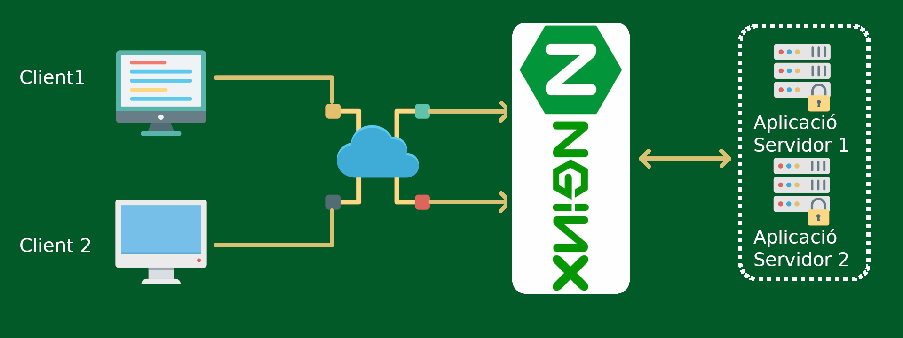

# Balancejador de càrrega NGINX insegur

En aquesta documentació el que trobarem serà crear un balancejador de càrrega NGINX amb 3 servidors apache. Els servidors Apache, serviran les pàgines amb http, cosa que també farà el nostre balancejador de càrrega


---
**APRENDRÀS:**

- **Docker compose**: Fer feina amb varis contenidors dins una mateixa xarxa de docker i tot engegat amb docker compose
- **Instal·lar NGINX load balancer**: Veuràs com configurar el balancejador de càrrega amb el docker compose.
- **Instal·lar Apache**: Veuràs com instal·lar i configurar els apaches necessaris
- **Creació de l'estructura del directori**: Planificar correctament l'estructura de directoris que ha de tenir la configuració

---
## Estructura del directori

El que farem primer serà crear una estructura de directori que contengui tots el directoris i fitxers necessaris per aixecar correctament els serveis amb docker compose.

```bash
marti@ubntsr2404apache:~$ tree
.
└── docker
    └── nginx
        ├── docker-compose.yml
        ├── html1
        │   └── index.html
        ├── html2
        │   └── index.html
        ├── html3
        │   └── index.html
        └── nginx.conf

5 directories, 5 files
```

Com veiem tindrem una carpeta docker, que dins té la carpeta nginx que conté:
- les carpetes htmlX, que contenen l'html de cada Apache
- el fitxer de configuració nginx.conf

## Creació del docker compose

Emprarem el següent docker-compose.yml per crear els 3 Apaches i el balancejador de càrrega tot a l'hora. El que és recomanable és separar els 4 serveis en servidors diferents, per si un servidor cau, no se vegi afectat tot el sistema. Però en aquest cas empram aquesta configuració per temes d'economitzar màquines i CPU.

```yaml
services:
  # Servicio de Apache 1
  apache1:
    image: httpd:latest  # Imagen oficial de Apache
    container_name: apache1
    ports:
      - "8080:80"  # Exponemos el puerto 8080 en el host
    networks:
      - webnet
    volumes:
      - /home/marti/docker/nginx/html1:/usr/local/apache2/htdocs/  # Montamos la carpeta html en el contenedor (opcional)

  # Servicio de Apache 2
  apache2:
    image: httpd:latest
    container_name: apache2
    ports:
      - "8081:80"  # Exponemos el puerto 8081 en el host
    networks:
      - webnet
    volumes:
      - /home/marti/docker/nginx/html2:/usr/local/apache2/htdocs/  # Montamos la carpeta html en el contenedor (opcional)

  # Servicio de Apache 3
  apache3:
    image: httpd:latest
    container_name: apache3
    ports:
      - "8082:80"  # Exponemos el puerto 8082 en el host
    networks:
      - webnet
    volumes:
      - /home/marti/docker/nginx/html3:/usr/local/apache2/htdocs/  # Montamos la carpeta html en el contenedor (opcional)

 # Servicio de NGINX como balanceador de carga
  nginx:
    image: nginx:latest
    container_name: nginx-lb
    ports:
      - "443:443"  # Puerto HTTPS
      - "80:80"    # Puerto HTTP (para redirigir a HTTPS)
    networks:
      - webnet
    volumes:
      - /home/marti/docker/nginx/nginx.conf:/etc/nginx/nginx.conf:ro  # Montamos el archivo de configuración de NGINX
    depends_on:
      - apache1
      - apache2
      - apache3

networks:
  webnet:
    driver: bridge
```

## Configuració dels servidors 

Configuram el servdior nginx, mitjançant el fitxer nginx.conf:

```bash
worker_processes auto;

events {
    worker_connections 1024;
}

http {
    upstream apache_servers {
        server apache1:80;
        server apache2:80;
        server apache3:80;
    }

    server {
        listen 80;
        server_name apaches.local;
        location / {
            proxy_pass http://apache_servers;  # Usamos el bloque upstream para balanceo de carga
            proxy_set_header Host $host;
            proxy_set_header X-Real-IP $remote_addr;
            proxy_set_header X-Forwarded-For $proxy_add_x_forwarded_for;
            proxy_set_header X-Forwarded-Proto $scheme;
        }
    }
}
```

Com veim, li indicam els nostres servidors i a quin port escolten. Hem de tenir present que els contenidors estan corrent plegats i dins el mateix contexte i per tant es veuen els noms (tal i com els hem definit al docker compose) i els ports són els natius, no els que exposa el docker compose. En cas de que separéssim els Apaches de l'NGINX, hauríem de posar el nom o adreça correctes, així com els ports exposats.

## Creació dels index.html

Finalment, ja per acabar, posarem en cada carpeta html un fitxer index.html que ens indiqui que estam en un servidor diferent:

```html
<!doctype html>
<html>
  <head>
    <title>APACHE1</title>
  </head>
  <body>
    <p>APACHE1 - Servidor web </>
  </body>
</html>
```

